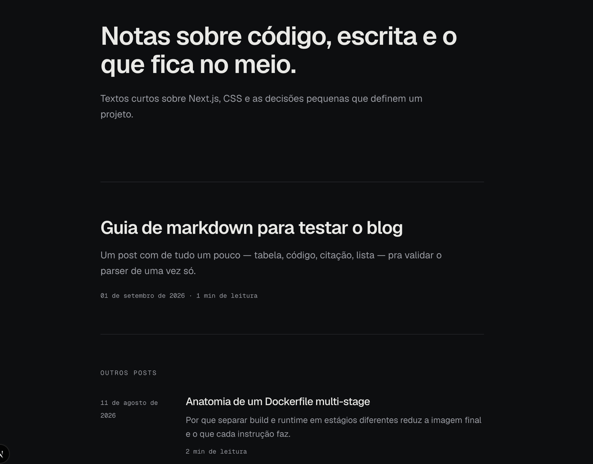

# mini-blog

<p align="center">
  
</p>

A minimal, file-based blog built with **Next.js 16** — no database, no CMS. Every post is a markdown file versioned in git, and **git is the CMS**: publishing or unpublishing is just editing frontmatter and shipping a commit.

This project was built end-to-end with [Claude Code](https://claude.com/claude-code) as an experiment in pairing an AI coding agent with a brand-new major framework version. Next.js 16 shipped breaking changes ahead of most models' training data, so the workflow leaned on reading the framework's own bundled docs (`node_modules/next/dist/docs/`) before writing routing, caching, or deployment code, rather than relying on memorized conventions.

## How it works

- **Content** lives in `.cms/` as plain markdown files with frontmatter (`title`, `publishedAt`, `status`, tags, etc.).
- **Business logic** is framework-agnostic and lives in `packages/factory/contents/` — reading posts from disk, parsing frontmatter, rendering markdown to HTML, and sorting by publish date (newest first). It has zero knowledge of React, Next.js, or the browser, so routes only orchestrate and render.
- **Routes** in `app/` are thin: the post listing (`app/page.tsx`) and the post detail page (`app/posts/[slug]/page.tsx`) just call the content factory and render the result.
- **Markdown pipeline** uses `unified` + `remark`/`rehype` with `shiki` for syntax-highlighted code blocks.

Since there's no database and no runtime writes, the app is fully static-friendly and the filesystem stays read-only in production — exactly what serverless deployments expect.

## Tech stack

- [Next.js 16](https://nextjs.org) (App Router, React 19)
- [Tailwind CSS v4](https://tailwindcss.com) — configured entirely in CSS via `@theme inline`, no config file
- [Bun](https://bun.sh) as package manager and script runner
- TypeScript in strict mode

## Getting started

```bash
bun install
bun dev      # http://localhost:3000
```

Other commands:

```bash
bun run build
bun start      # serve the production build
bun run lint
```

## Publishing a post

Add a markdown file to `.cms/`:

```yaml
---
title: My post
publishedAt: 2026-03-02
status: published   # published | draft — omitted defaults to published
---
```

Posts with `status: draft` never show up in the listing or the detail page.

Flow: edit the `.md` file → commit → push → deploy. There's intentionally no endpoint to change a post's status at runtime — in serverless the filesystem is read-only, and on a regular server a runtime write would vanish on the next deploy and drift the repo away from the live site.

## Deployment

Deployed on [Vercel](https://vercel.com). The project's Framework Preset must be set to **Next.js** — leaving it on "Other" makes Vercel treat the app as a static site (it only copies `public/` and skips building routes/functions), which serves a 404 for every page.
